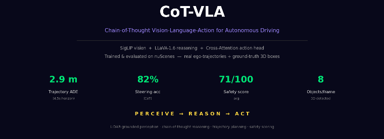
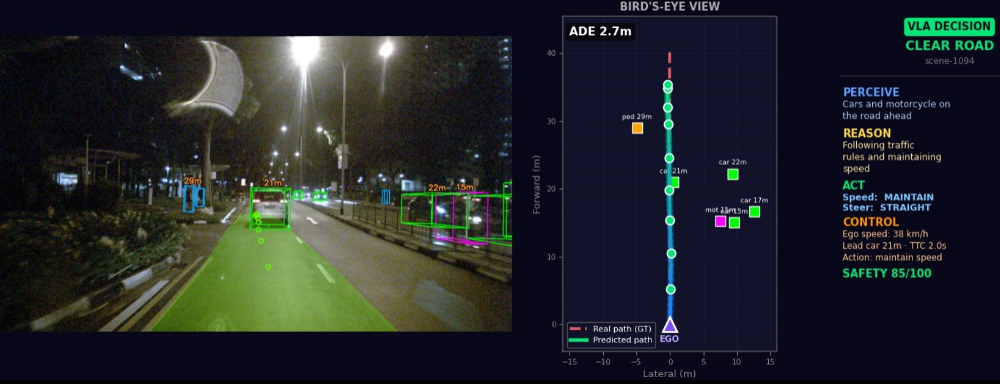
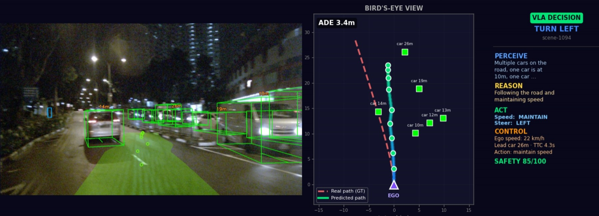
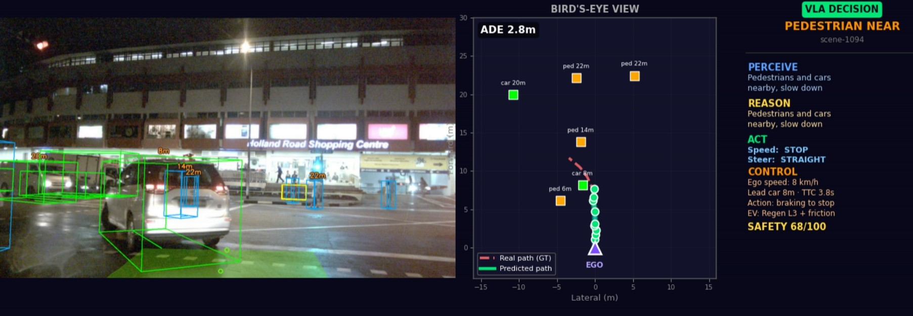
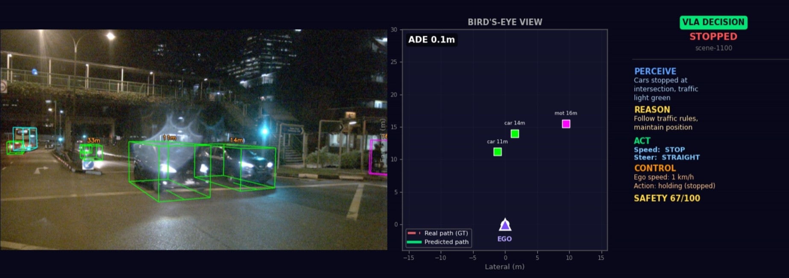
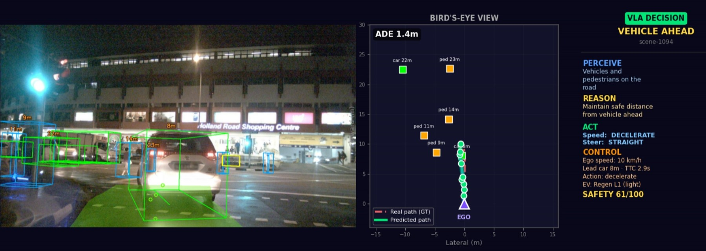

# CoT-VLA — Chain-of-Thought Vision-Language-Action on nuScenes

A small autonomous-driving agent that **reasons before it acts**. For each front-camera frame it detects the surrounding objects in 3D, asks a vision-language model *why* it should do something, predicts the actual driving trajectory with a trained action head, and scores the safety and longitudinal control of the decision.

<p align="center">
  
</p>
## 3D detection on nuScenes

Ground-truth 3D boxes with class and metric distance, on the front camera (Singapore night scenes).

<p align="center">
  
  
</p>
<p align="center">
  
  
</p>
<p align="center">
  
</p>
> The language model gives the **reasoning** ("pedestrian close, slow down"); a trained SigLIP + cross-attention head gives the **precise trajectory**. Trained and evaluated on the **nuScenes mini** split, so the trajectory ground truth is the car's real recorded path.

This is an implementation / learning project that follows the recent chain-of-thought VLA-for-driving line of work (e.g. CoT4AD, AutoDrive-R²) — it is not a novel architecture. The goal was to build the full perception → reasoning → planning → control loop end to end and understand the trade-offs.

---

## What it does

For every keyframe:

| Stage | Component | Output |
|-------|-----------|--------|
| **Perceive** | nuScenes ground-truth 3D boxes | objects with class + metric distance |
| **Reason** | LLaVA-1.6-Mistral-7B (4-bit) | chain-of-thought: *what it sees, why* |
| **Act** | SigLIP + cross-attention head (trained) | 9-waypoint trajectory + speed + steering |
| **Assess** | safety score + kinematics | risk 0–100, TTC, deceleration, EV regen level |

The split is deliberate: LLaVA reasons in language but is unreliable at numeric waypoints, so a trained head owns the geometry while LLaVA owns the explanation.

## Architecture

```
front camera ─► SigLIP (frozen) ─┐
                                 ├─► cross-attention ─► waypoints + speed + steering
instruction  ─► Sentence-BERT ───┘        (trained)

front camera + detections ─► LLaVA-1.6 ─► perception / reasoning / suggested action
3D boxes (GT) ─────────────► distance, TTC, deceleration, safety score
```

## Results

On the nuScenes-mini test scenes (held-out, early-stopped at the best validation epoch):

| Metric | Value | Notes |
|--------|-------|-------|
| Trajectory ADE | **≈ 4.6 m** | over a **4.5 s** horizon, vs. real ego-trajectory |
| Steering accuracy (CoT) | ≈ 82% | LLaVA vs. trajectory-derived label |
| Avg. safety score | ≈ 70 / 100 | obstacle proximity + model agreement + action + confidence |
| Objects / frame | ≈ 8 | ground-truth 3D boxes |

These are honest small-data numbers, not state of the art. Research labs train much larger models on the full nuScenes set; the value here is the complete, explainable pipeline.

## Run it

1. Open `CoT_VLA_nuScenes.ipynb` in Google Colab and select a **T4 GPU**.
2. Download the nuScenes **`v1.0-mini`** split (≈4 GB, free account at [nuscenes.org](https://www.nuscenes.org/nuscenes#download)) and extract it to `/content/nuscenes` so it contains `samples/ sweeps/ maps/ v1.0-mini/`.
3. Run the cells top to bottom. The first Setup cell pins `numpy<2` for the devkit and restarts once — re-run it after the restart.

Heavy steps: feature extraction and training (~minutes), LLaVA CoT over the test set (~several minutes on a T4).

## How it works (a bit more detail)

- **Real trajectory ground truth.** nuScenes records the ego pose at every keyframe. Future poses are transformed into the current ego frame to produce a genuine trajectory to predict — curves, slow-downs and stops are all real driving, not hand-written rules.
- **Sensor-grounded detection.** Ground-truth 3D boxes are read directly in the camera frame; the forward depth of each box is the object's metric distance, which feeds both the reasoning prompt and the safety score.
- **Consistent control.** The longitudinal control (deceleration, EV regen level) is derived from the predicted trajectory itself, so the displayed control never contradicts the action head's speed command. Time-to-collision uses the in-lane lead object.

## Limitations

- Trained on the **mini** split (small); the model overfits quickly, so we keep the best-validation checkpoint.
- LLaVA reasoning is **zero-shot** — it can disagree with the trained head; the safety score captures that disagreement.
- The deceleration → regen mapping is a **rule-based control layer** on top of the learned outputs, not a learned or vehicle-calibrated model.
- TTC assumes a static lead (conservative).

## Related work

- CoT-VLA: Visual Chain-of-Thought Reasoning for Vision-Language-Action Models (NVIDIA, CVPR 2025)
- CoT4AD: A VLA Model with Explicit Chain-of-Thought Reasoning for Autonomous Driving (2025)
- AutoDrive-R²: Reasoning and Self-Reflection for VLA Models in Autonomous Driving (2025)

## Acknowledgements

Built on [nuScenes](https://www.nuscenes.org/), SigLIP, Sentence-Transformers and LLaVA. Developed with AI coding assistance — the work was in the architecture decisions, debugging, and understanding the trade-offs.
